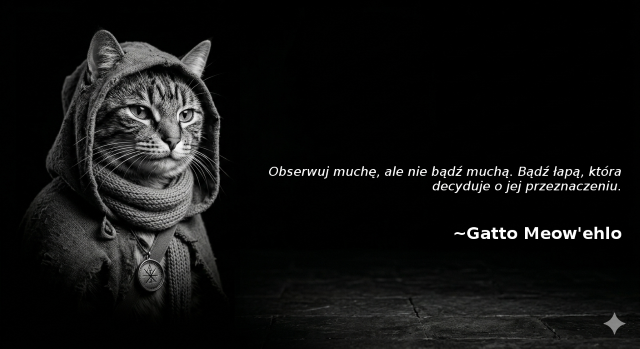

# virtual-threads

A project composed of two Spring-Boot services hosted on Apache Tomcat that should show
practical capabilities of virtual threads.

### gatto-guidance

Inspired by **Paulo Coelho**, this service introduces his feline counterpart - **Gatto Meow'elho**: an AI based persona
that delivers guidance to everyone who requests it.  
It also has prerecorded sentences cache to override GenAI limits and save $$$ 😼

### gatto-image

This service uses generated AI images of feline philosopher to render retrieved guidance as a **meme**.  
Uses *gatto-guidance* service is as a data source.

## Requirements:

To properly run these projects, you need:
* **JDK 25** (recommended distribution - *temurin*)
* [Task](https://taskfile.dev/installation/) (for easier management)
* [vegeta](https://github.com/tsenart/vegeta) load testing tool

## How to use:

* run `task gatto-guidance:run` to build and run guidance generating service
* run `task gatto-image:run` to build and run image rendering service
* open endpoint: http://localhost:8080/gatto-image/guidance using your favourite browser (even `curl`)
* ta-da! have fun with Gatto Meow'elho

## Toggles:
Projects are equipped with customizable toggles that allow tweaking the configuration without re-building whole service.  
These toggles may be set as an `env` variables to be automatically picked up by Spring Boot runner.

### gatto-guidance

* `${GATTO_PERSONIFIED_RATIO}` - how many % of requests should be routed to Gatto Meow'elho AI persona (default: *0*)
* `${GATTO_PUBLISHING_DELAY}` - artificial delay for prerecorded responses (default: *5 seconds*)
* `${GATTO_ENABLE_VIRTUAL}` - should replace platform worker threads with virtual ones? (default: *false*)
* `${GATTO_GEN_AI_KEY}` - Gemini GenAI API key (needed only when personified ratio > *0*)

### gatto-image

* `${IMG_CPU_POOL}` - should use dedicated CPU work-stealing pool for image generation? (default: *false*)
* `${IMG_MAX_THREADS}` - how many platform worker threads should handle incoming requests? (default: *200*)
* `${IMG_ENABLE_VIRTUAL}` - should replace platform worker threads with virtual ones? (default: *false*)

## Useful JFR views/events

Each service has proper task: `${service}:run-with-jfr` to record samples using *Java Flight Recorder*. Below are listed
several views/events that might be helpful when comparing platform/virtual threads.

* `ResidentSetSize` - check application memory consumption (OS perspective)
* `NativeMemoryUsageTotal` - check application memory consumption (JVM perspective)
* `native-memory-reserved` - reserved memory by type
* `native-memory-committed` - committed memory by type
* `pinned-threads` - check if some virtual threads were pinned

